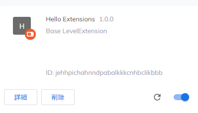
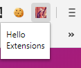

# Extensionsチュートリアル

`manifest.json`に拡張機能の各主動作や機能を記述する．




## UIの作成
拡張機能は多くの形式のUIを持つことができる．主に，ポップアップを使用する．
今回はボタンを使用した，背景色を変更するポップアップ(`popup.html`)を作成する．
作成後は，マニフェストでこのファイルを指定しなければならない．

**公式は`page_action`になっているが，実際は`browser_action`としないと動作しない．**

```
  "browser_action":{
    "default_popup": "popup.html"
  },
```

`popup.html`にはボタンを設置する．
```
  <button id="changeColor"></button>
```

## アイコンの指定
次に，ツールバーのアイコン(16x16, 32x32, 48x48, 128x128)を指定する．

```
  "browser_action":{
    "default_popup": "popup.html",
    "default_icon": {
      "16": "images/get_started16.png",
      "32": "images/get_started32.png",
      "48": "images/get_started48.png",
      "128": "images/get_started128.png"
    }
  },
```
画像はGoogleが提供するものを使用している．

さらに，このアイコンはツールバーだけではなくパーミッションの警告時やfavicon等に使用されるので，
これもマニフェストで指定する．

## バックグラウンドプロセスの作成
次に，バックグラウンドプロセスでログを出力してみる．
バックグラウンドプロセスを処理するファイルを指定する．

```
  "background":{
    "scripts": ["background.js"],
    "persistent": false
  },
```

```
chrome.runtime.onInstalled.addListener(function() {
  chrome.storage.sync.set({color: '#3aa757'}, function a() {
    console.log('The color is green.');
  });
  chrome.declarativeContent.onPageChanged.removeRules(undefined, function() {
    chrome.declarativeContent.onPageChanged.addRules([{
      conditions: [new chrome.declarativeContent.PageStateMatcher({
        pageUrl: {hostEquals: 'developer.chrome.com'},
      })
      ],
      actions: [new chrome.declarativeContent.ShowPageAction()]
    }]);
  });
});
```

加えて，`background.js`を実行する際にアクセスする権限を明記する．

```
    "permissions": ["declarativeContent", "storage"],

```

## 実際の動作の作成
`popup.html`のボタンを使用した際の動作を`popup.js`に記述する．

```
let changeColor = document.getElementById('changeColor');

chrome.storage.sync.get('color', function(data) {
  changeColor.style.backgroundColor = data.color;
  changeColor.setAttribute('value', data.color);
});
```

```
<script src="popup.js"></script>
```

これでツールバーのアイコンをクリックすると緑色のボタンが出現する．

```
アイコンクリック→popup.html読み込み→popup.js実行
バックグラウンドプロセスの実行
```

の流れ．

## オプションの作成

設定ページ`options.html`と動作`options.js`を作成する．

```
<!DOCTYPE html>
<html>
  <head>
    <style>
      button {
        height: 30px;
        width: 30px;
        outline: none;
        margin: 10px;
      }
    </style>
  </head>
  <body>
    <div id="buttonDiv">
    </div>
    <div>
      <p>Choose a different background color!</p>
    </div>
  </body>
  <script src="options.js"></script>
</html>
```

```
let page = document.getElementById('buttonDiv');
const kButtonColors = ['#3aa757', '#e8453c', '#f9bb2d', '#4688f1'];
function constructOptions(kButtonColors) {
  for (let item of kButtonColors) {
    let button = document.createElement('button');
    button.style.backgroundColor = item;
    button.addEventListener('click', function() {
      chrome.storage.sync.set({color: item}, function() {
        console.log('color is ' + item);
      })
    });
    page.appendChild(button);
  }
}
constructOptions(kButtonColors);
```

最後にオプションページがあることと，そのファイルをマニフェストに記述する．

```
  "options_page": "options.html",
```

オプションページで，ボタンの色を変更することができる．
